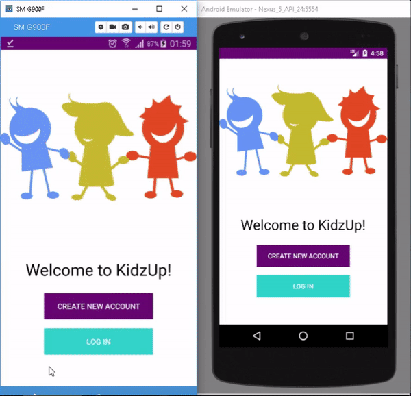
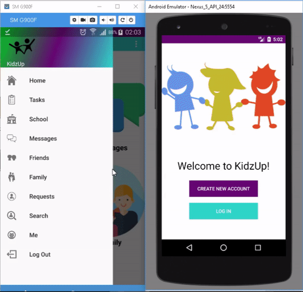
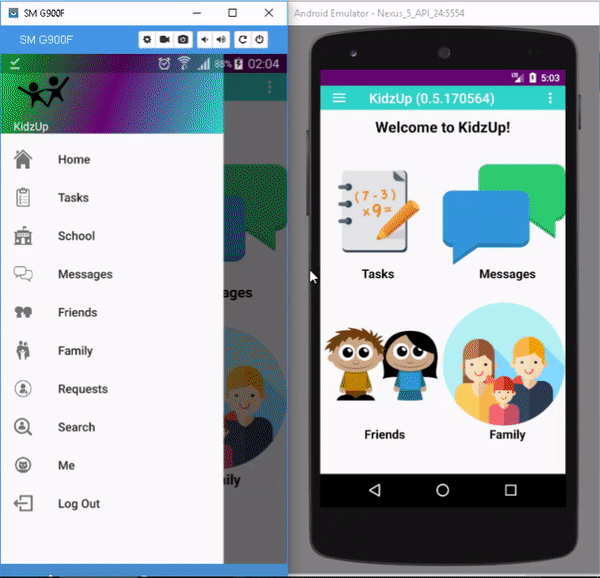
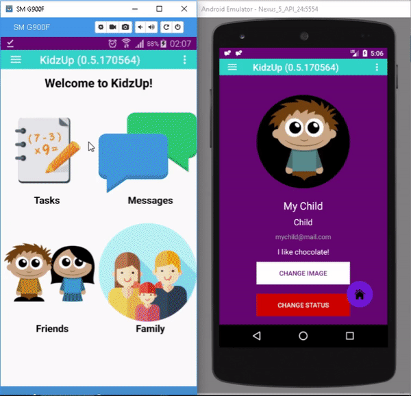
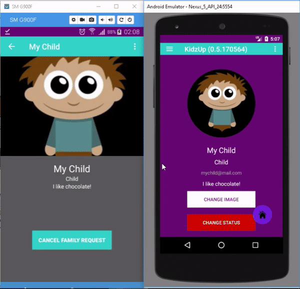
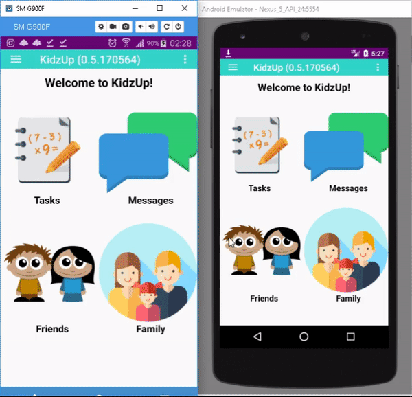
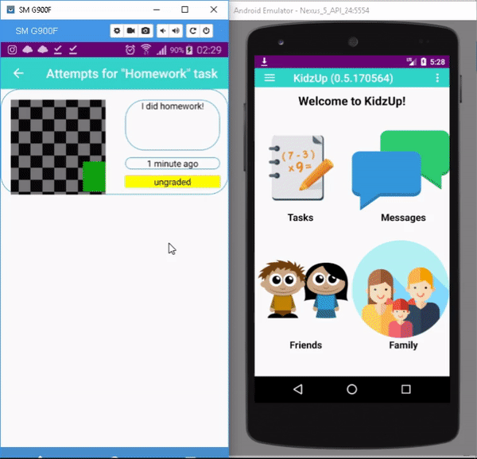

# KidzUp

Social Network application aimed for parents-children interaction.
Currently is in developing state.

## Table of Contents (Optional)

- [Available functions](#available-functions)
- [Built with](#built-with)
- [Authors](#authors)

## Available Functions

### Sign up

### Sign in

### Set up Profile

### Send friend request

### Send Family Request

### Accept Family Request

### Messaging

### Creating a task

### Attempting to complete task

### Accepting task attempt

### Confirming accepted attempt

## Built with
* [FireBase](https://firebase.google.com/) - database, storage, users accounting etc.

## Authors
* **Denis Kim** - *Initial Work* - [Stialt](https://github.com/Stialt)
