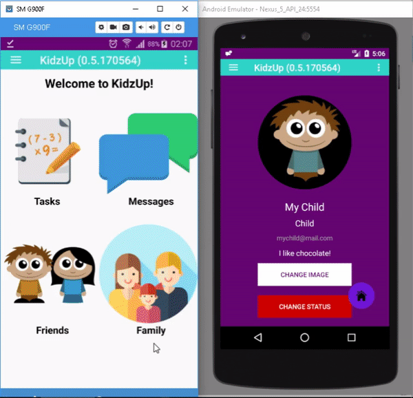

# KidzUp

Social Network application aimed for parents-children interaction.
Currently is in developing state.

## Table of Contents (Optional)

- [Built with](#built-with)
- [Available functions](#available-functions)
- [Authors](#authors)

## Built with
* [FireBase](https://firebase.google.com/) - database, storage, users accounting etc.
* [CircleImageView](https://github.com/hdodenhof/CircleImageView) - circle shaped Image View.
* [Android-Image-Cropper](https://github.com/ArthurHub/Android-Image-Cropper) - image cropping.
* [Picasso](https://square.github.io/picasso/) - image loading and transformation.
* [Compressor](https://github.com/zetbaitsu/Compressor) - image compressor.

## Available Functions

### Sign up

### Sign in

### Set up Profile

### Send friend request

### Send Family Request

### Accept Family Request

### Messaging

### Creating a task

### Attempting to complete task

### Accepting task attempt

### Confirming accepted attempt

## Authors
* **Denis Kim** - *Initial Work, Implementation* - [Stialt](https://github.com/Stialt)
* **Assem Oinar** - *Idea, Research, Database* - [OinarAssem](https://github.com/oinarassem)
